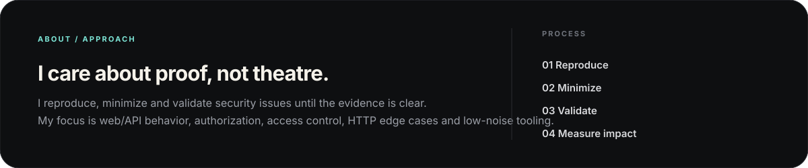
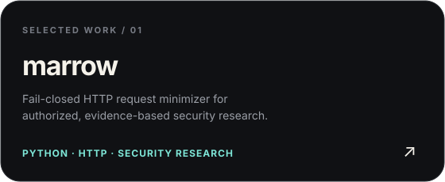
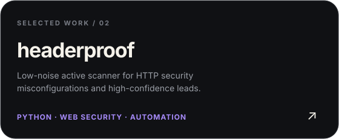

  <picture>
    <source media="(prefers-color-scheme: dark)" srcset="./assets/dark.svg">
    <source media="(prefers-color-scheme: light)" srcset="./assets/light.svg">
    
  </picture>

 

<table width="100%">
<tr>
<td width="30%" align="center" valign="middle">
  
</td>
<td width="40%" align="center" valign="middle">
  
</td>
<td width="30%" align="center" valign="middle">
  
</td>
</tr>
</table>

 

  

 

<table width="100%">
<tr>
<td width="50%" align="center" valign="top">
  
</td>
<td width="50%" align="center" valign="top">
  
</td>
</tr>
</table>

 

  <a href="https://github.com/TayfurYldz"><strong>GitHub</strong></a>
  &nbsp;&nbsp;·&nbsp;&nbsp;
  <a href="https://www.ariacreative.net.tr"><strong>Website</strong></a>
  &nbsp;&nbsp;·&nbsp;&nbsp;
  <a href="mailto:yildiztayfur668@gmail.com"><strong>Email</strong></a>

