<div align="center">
  <picture>
    <source media="(prefers-color-scheme: dark)" srcset="./assets/dark.svg">
    <source media="(prefers-color-scheme: light)" srcset="./assets/light.svg">
    
  </picture>
</div>

<br>

<div align="center">
  <strong>Security Research · Bug Bounty · Web & API Security · Offensive Tooling</strong>
  <br><br>
  <code>signal &gt; noise</code> · <code>proof &gt; guess</code> · <code>impact &gt; hype</code>
</div>

<br>

<div align="center">
  
</div>

<div align="center">
  <sub>evidence-first research · clean reproduction · measurable impact · low-noise validation</sub>
</div>

<br>

```text
$ profiles
github    -> https://github.com/TayfurYldz
linkedin  -> https://www.linkedin.com/in/tayfur-yıldız-3b7820391
bugcrowd  -> https://bugcrowd.com/h/tayfuryldz
website   -> https://www.ariacreative.net.tr
email     -> yildiztayfur668@gmail.com

$ focus
web/api · authn/authz · access control · business logic · low-noise tooling
```

### Profiles

[](https://github.com/TayfurYldz)
[](https://www.linkedin.com/in/tayfur-yıldız-3b7820391)
[](https://bugcrowd.com/h/tayfuryldz)
[](https://www.ariacreative.net.tr)
[](mailto:yildiztayfur668@gmail.com)

### About

I focus on practical security research: reproducing, minimizing, and validating security issues with clear evidence. My work centers on web and API behavior, authentication and authorization logic, access control, HTTP edge cases, and building low-noise tooling for authorized research.

### Current work

<table>
<tr>
<td width="50%" valign="top">

#### [`marrow`](https://github.com/TayfurYldz/marrow)
Fail-closed, evidence-based HTTP request minimizer for authorized security research.

`Python` · `HTTP` · `Security Research`

</td>
<td width="50%" valign="top">

#### [`headerproof`](https://github.com/TayfurYldz/headerproof)
Fast, low-noise active scanner for CORS, CSRF, header injection, cache poisoning, and content-spoofing leads.

`Python` · `Web Security` · `Automation`

</td>
</tr>
</table>

### Research protocol

```text
01 // reproduce
02 // minimise
03 // validate
04 // measure impact
05 // report cleanly
```

### Stack

<p>
  
  
  
  
  
</p>
