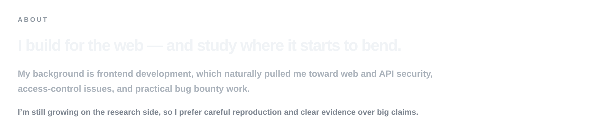

<picture>
  <source media="(prefers-color-scheme: dark)" srcset="./assets/intro-dark.svg">
  <source media="(prefers-color-scheme: light)" srcset="./assets/intro-light.svg">
  
</picture>

  <a href="https://www.ariacreative.net.tr"><strong>Website</strong></a>
  &nbsp;&nbsp;·&nbsp;&nbsp;
  <a href="mailto:yildiztayfur668@gmail.com"><strong>Email</strong></a>

 

<picture>
  <source media="(prefers-color-scheme: dark)" srcset="./assets/about-dark.svg">
  <source media="(prefers-color-scheme: light)" srcset="./assets/about-light.svg">
  
</picture>

 

<table width="100%">
<tr>
<td width="50%" align="center" valign="top">
  
</td>
<td width="50%" align="center" valign="top">
  
</td>
</tr>
<tr>
<td width="50%" align="center" valign="top">
  
</td>
<td width="50%" align="center" valign="top">
  
</td>
</tr>
</table>

 

  selected work
    
  <a href="https://github.com/TayfurYldz/marrow"><b>marrow</b></a>
  &nbsp;·&nbsp;
  <a href="https://github.com/TayfurYldz/headerproof"><b>headerproof</b></a>
  &nbsp;·&nbsp;
  <a href="https://www.ariacreative.net.tr"><b>ariacreative.net.tr</b></a>

