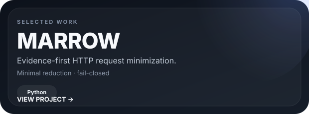
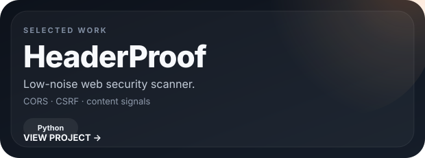

<picture>
  <source media="(prefers-color-scheme: dark)" srcset="./assets/hero-dark.svg">
  <source media="(prefers-color-scheme: light)" srcset="./assets/hero-light.svg">
  
</picture>

  <a href="https://www.ariacreative.net.tr"><strong>Website</strong></a>
  &nbsp;&nbsp;·&nbsp;&nbsp;
  <a href="mailto:yildiztayfur668@gmail.com"><strong>Email</strong></a>

 

Frontend-focused developer exploring web security, APIs, access control, and practical research tooling.

 

  
  

 

  
  
  

