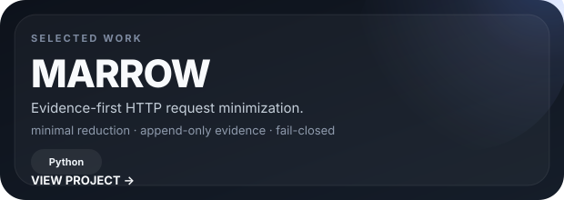
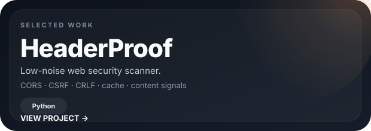
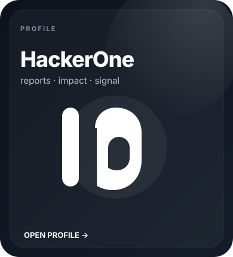
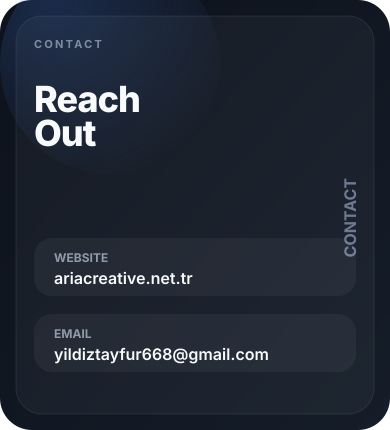

<picture>
  <source media="(prefers-color-scheme: dark)" srcset="./assets/hero-dark.svg">
  <source media="(prefers-color-scheme: light)" srcset="./assets/hero-light.svg">
  
</picture>

  Frontend-focused developer exploring web security, APIs, access control, and research tooling.

 

  
  

 

  
  

  
  

