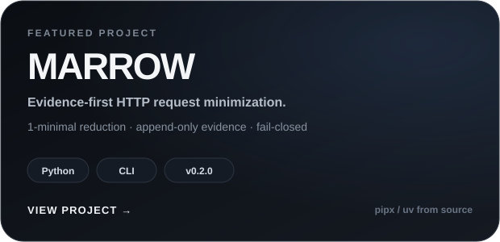
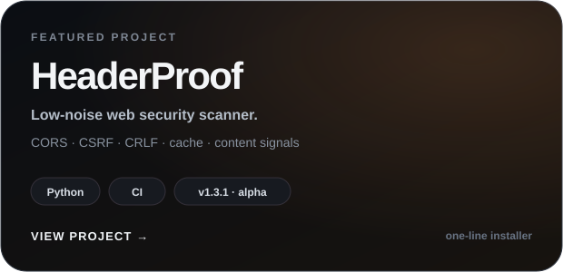

<picture>
  <source media="(prefers-color-scheme: dark)" srcset="./assets/intro-dark.svg">
  <source media="(prefers-color-scheme: light)" srcset="./assets/intro-light.svg">
  
</picture>

  <a href="https://www.ariacreative.net.tr"><strong>Website</strong></a>
  &nbsp;&nbsp;·&nbsp;&nbsp;
  <a href="mailto:yildiztayfur668@gmail.com"><strong>Email</strong></a>

 

## About

I build web interfaces and increasingly work on the security side of the same systems. My focus is web and API behavior, access control, and research tooling that makes testing easier to reproduce and reason about.

I prefer practical work: understand the application, reduce the problem, reproduce it cleanly, and document the evidence.

 

## Featured work

Versioned projects with clear installation paths, documentation, and explicit maturity.

<table width="100%">
<tr>
<td width="50%" align="center" valign="top">
  
</td>
<td width="50%" align="center" valign="top">
  
</td>
</tr>
</table>

  <b>MARROW v0.2.0</b> · versioned CLI · pipx / uv from source &nbsp;&nbsp;|&nbsp;&nbsp; <b>HeaderProof v1.3.1</b> · developer alpha · CI · one-line installer

 

## Elsewhere

<table width="100%">
<tr>
<td width="50%" align="center" valign="top">
  
</td>
<td width="50%" align="center" valign="top">
  
</td>
</tr>
<tr>
<td colspan="2" align="center" valign="top">
  
</td>
</tr>
</table>
