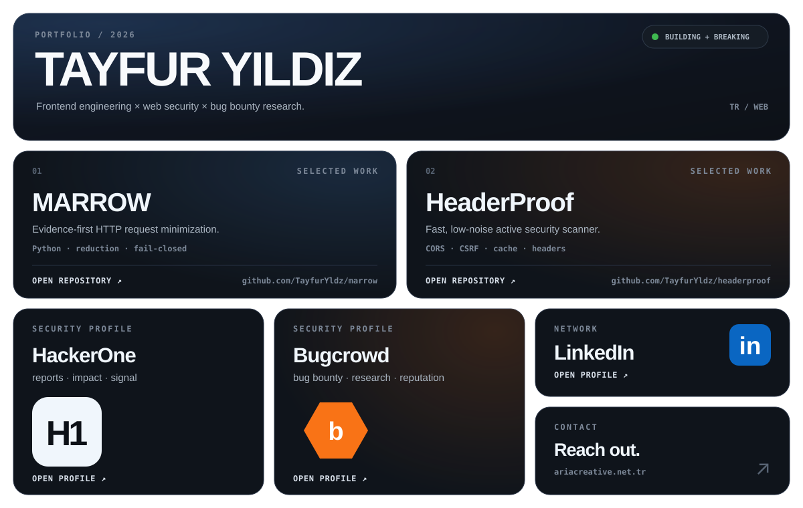

<picture>
  <source media="(prefers-color-scheme: dark)" srcset="./assets/bento-dark.svg">
  <source media="(prefers-color-scheme: light)" srcset="./assets/bento-light.svg">
  
</picture>

  <a href="https://github.com/TayfurYldz/marrow">Marrow</a>
  &nbsp;·&nbsp;
  <a href="https://github.com/TayfurYldz/headerproof">HeaderProof</a>
  &nbsp;·&nbsp;
  <a href="https://hackerone.com/tayfuryldzz">HackerOne</a>
  &nbsp;·&nbsp;
  <a href="https://bugcrowd.com/h/tayfuryldz">Bugcrowd</a>
  &nbsp;·&nbsp;
  <a href="https://www.linkedin.com/in/tayfur-y%C4%B1ld%C4%B1z-3b7820391">LinkedIn</a>
  &nbsp;·&nbsp;
  <a href="https://www.ariacreative.net.tr">Website</a>

